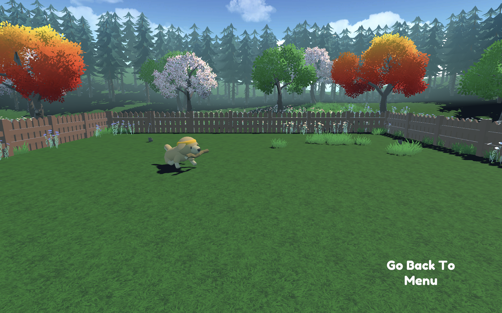

# Huggy — Reinforcement Learning with Unity ML-Agents

A hands-on deep reinforcement learning project where I trained **Huggy**, a virtual dog agent, to learn behaviors using Unity ML-Agents and the PPO (Proximal Policy Optimization) algorithm.

## 🎯 Project Overview
This project is part of my deep RL learning journey. Huggy is a pre-built Unity environment where an agent (a dog) learns to interact with its environment through trial and reward, using reinforcement learning.

## 🛠️ Tools & Tech
- Unity ML-Agents
- PPO (Proximal Policy Optimization)
- Python, Google Colab
- Config: [`config/Huggy.yaml`](config/Huggy.yaml)

## ⚙️ Setup
1. Clone [Unity ML-Agents](https://github.com/Unity-Technologies/ml-agents)
2. Install dependencies:
   ```
   pip install -e ./ml-agents-envs
   pip install -e ./ml-agents
   ```
3. Run training:
   ```
   mlagents-learn ./config/Huggy.yaml --env=<path-to-Huggy-executable> --run-id="Huggy" --no-graphics
   ```

## 📊 Results
Trained for 2,000,000 timesteps using PPO. The agent's mean reward improved steadily during training, plateauing around **~3.7–4.1** in the final stages.

| Metric | Value |
|---|---|
| Final Mean Reward (step 2M) | 3.743 |
| Peak Mean Reward (step ~1.55M) | 4.093 |
| Training Steps | 2,000,000 |
| Algorithm | PPO |

Trained model hosted on Hugging Face Hub: [Ebishj/Huggy](https://huggingface.co/Ebishj/Huggy)

## 🎥 Demo
Watch Huggy fetch the stick live in the interactive demo:
🔗 [Play with Huggy on Hugging Face Spaces](https://huggingface.co/spaces/ThomasSimonini/Huggy)
*(Search username: `Ebishj`, then select the `Huggy` model)*



🎬 [Watch the demo video](YOUR_YOUTUBE_OR_STREAMABLE_LINK_HERE)

## 📚 What I Learned
- Setting up and debugging a Python/conda environment for compatibility with ML-Agents on Google Colab
- Configuring and tuning PPO hyperparameters (batch size, learning rate, discount factor, GAE)
- Reading and interpreting training logs (mean reward, reward std) to monitor convergence
- Managing training checkpoints and resuming interrupted training runs
- Publishing a trained RL model and its config to the Hugging Face Hub

## 🔗 References
- [Unity ML-Agents Toolkit](https://github.com/Unity-Technologies/ml-agents)
- [Hugging Face Deep RL Course](https://huggingface.co/learn/deep-rl-course)
- [My trained model on Hugging Face](https://huggingface.co/Ebishj/Huggy)
